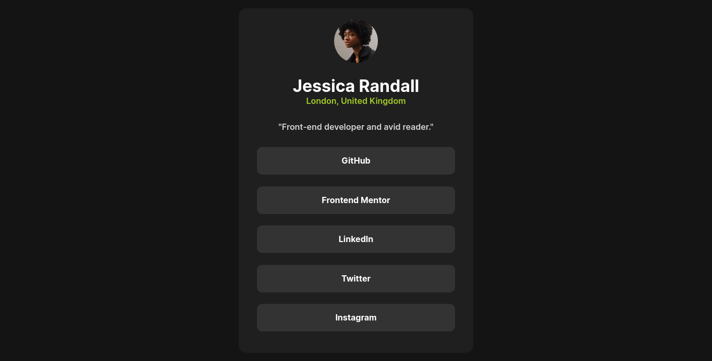

# Frontend Mentor - Social links profile solution

This is a solution to the [Social links profile challenge on Frontend Mentor](https://www.frontendmentor.io/challenges/social-links-profile-UG32l9m6dQ). Frontend Mentor challenges help you improve your coding skills by building realistic projects. 

## Table of contents

- [Overview](#overview)
  - [The challenge](#the-challenge)
  - [Screenshot](#screenshot)
  - [Links](#links)
- [My process](#my-process)
  - [Built with](#built-with)
  - [What I learned](#what-i-learned)
  - [Useful resources](#useful-resources)


## Overview

### The challenge

Users should be able to:

- See hover and focus states for all interactive elements on the page

### Screenshot




### Links

- Solution URL: [Add solution URL here](https://your-solution-url.com)
- Live Site URL: [Add live site URL here](https://your-live-site-url.com)

## My process

### Built with

- Semantic HTML5 markup
- CSS custom properties
- Flexbox
- Mobile-first workflow


### What I learned


To see how you can add code snippets, see below:

```html
<h1>Jessica Randall</h1>
```


```css
.card-container {
    background-color: var(--Dark-Grey);
    margin: 1rem 1.25rem;
    padding:1.25rem 2.2rem ;
    display: flex;
    flex-direction: column;
    justify-content: center;
    align-items: center;
    border-radius: 15px;
    width: 450px;
}
```

### Useful resources

- [ Resource 1](https://developer.mozilla.org/en-US/docs/Learn/CSS/CSS_layout/Flexbox) - This helped me very much. I really liked this pattern and will use it going forward.
- [Resource 2](https://css-tricks.com/snippets/css/a-guide-to-flexbox/) - This is an amazing article which helped me finally understand Flexbox. I'd recommend it to anyone still learning this concept.


